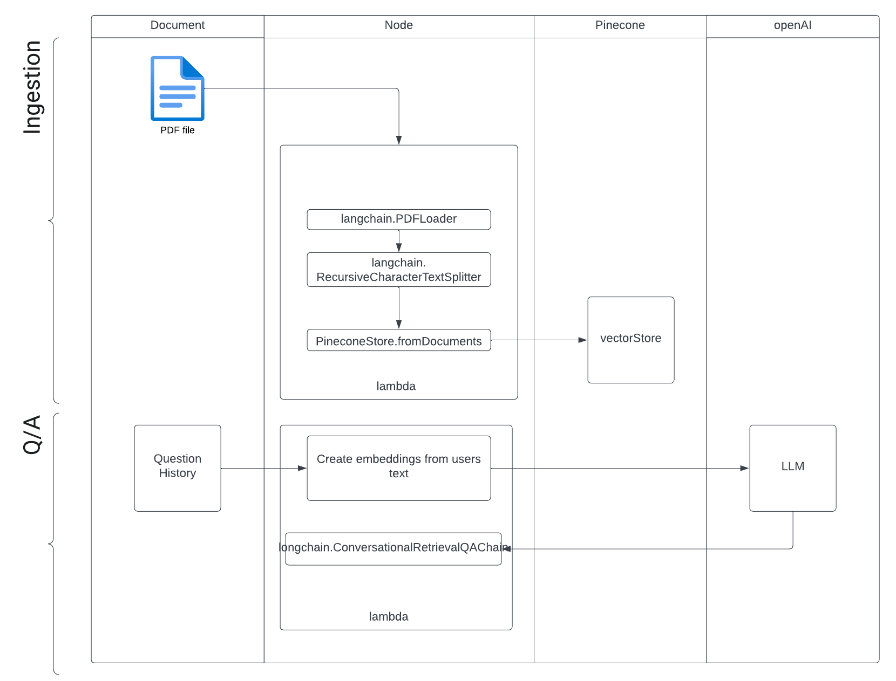

# answerPDF
Harnessing Vector Database and ChatGPT intuitive document analysis 




Create .env file with following variables
```
OPENAI_API_KEY=
PINECONE_ENVIRONMENT=
PINECONE_API_KEY=
PINECONE_INDEX_NAME=
PINECONE_NAME_SPACE=
```
Start the express server `node index.js`
Load file
```
curl --location 'http://localhost:3000/load' \
--header 'Content-Type: application/json' \
--data '{
    "filePath": "/Users/kris/Downloads/pdf-mls-handbook-2023.pdf"
}'

{"fileName":"pdf-mls-handbook-2023.pdf","message":"File loaded successfully"}
```
Talk to the document
```
curl --location 'http://localhost:3000/ask' \
--header 'Content-Type: application/json' \
--data '{
    "chat": "What is an MLS",
    "history": "",
    "filename": "pdf-mls-handbook-2023.pdf"
}'
```